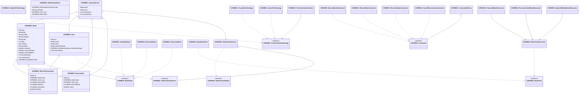

```mermaid
classDiagram
    class K2559603_Book {
        -String id
        -String title
        -String author
        -String category
        -String isbn
        -List<String> tags
        -List<String> reviews
        -String edition
        -boolean featured
        -boolean recommended
        -boolean specialEdition
        -List<K2559603_BorrowTransaction> borrowHistory
        -List<K2559603_Reservation> reservations
        -K2559603_BookState state
    }

    class K2559603_User {
        -String id
        -String name
        -String email
        -String contactNumber
        -K2559603_MembershipType membershipType
        -List<K2559603_BorrowTransaction> borrowHistory
    }

    class K2559603_BorrowTransaction {
        -String id
        -K2559603_Book book
        -K2559603_User user
        -LocalDate borrowDate
        -LocalDate dueDate
        -LocalDate returnDate
        -double finePaid
    }

    class K2559603_Reservation {
        -String id
        -K2559603_Book book
        -K2559603_User user
        -LocalDate reservedDate
        -boolean active
    }

    class K2559603_LibraryService {
        -Map<String,K2559603_Book> books
        -Map<String,K2559603_User> users
        -List<K2559603_BorrowTransaction> transactions
        -List<K2559603_Reservation> reservations
    }

    class K2559603_NotificationObserver
    <<interface>> K2559603_NotificationObserver

    class K2559603_NotificationSubject
    <<interface>> K2559603_NotificationSubject

    class K2559603_NotificationService

    class K2559603_NotificationEvent {
        -K2559603_NotificationEventType type
        -String message
        -K2559603_User user
        -K2559603_Book book
    }

    class K2559603_FineCalculationStrategy
    <<interface>> K2559603_FineCalculationStrategy

    class K2559603_StudentFineStrategy
    class K2559603_FacultyFineStrategy
    class K2559603_GuestFineStrategy
    class K2559603_FineCalculationContext

    class K2559603_BookState
    <<interface>> K2559603_BookState

    class K2559603_AvailableState
    class K2559603_BorrowedState
    class K2559603_ReservedState

    class K2559603_BookView
    <<interface>> K2559603_BookView

    class K2559603_BasicBookView
    class K2559603_BookViewDecorator
    class K2559603_FeaturedBookDecorator
    class K2559603_RecommendedBookDecorator
    class K2559603_SpecialEditionBookDecorator

    class K2559603_Command
    <<interface>> K2559603_Command

    class K2559603_BorrowBookCommand
    class K2559603_ReturnBookCommand
    class K2559603_ReserveBookCommand
    class K2559603_CancelReservationCommand
    class K2559603_CommandHistory

    K2559603_Book "1" o-- "*" K2559603_BorrowTransaction
    K2559603_Book "1" o-- "*" K2559603_Reservation
    K2559603_User "1" o-- "*" K2559603_BorrowTransaction
    K2559603_User ..|> K2559603_NotificationObserver

    K2559603_NotificationService ..|> K2559603_NotificationSubject
    K2559603_NotificationService "1" o-- "*" K2559603_NotificationObserver

    K2559603_AvailableState ..|> K2559603_BookState
    K2559603_BorrowedState ..|> K2559603_BookState
    K2559603_ReservedState ..|> K2559603_BookState
    K2559603_Book "1" o-- "1" K2559603_BookState

    K2559603_StudentFineStrategy ..|> K2559603_FineCalculationStrategy
    K2559603_FacultyFineStrategy ..|> K2559603_FineCalculationStrategy
    K2559603_GuestFineStrategy ..|> K2559603_FineCalculationStrategy
    K2559603_FineCalculationContext --> K2559603_FineCalculationStrategy

    K2559603_BasicBookView ..|> K2559603_BookView
    K2559603_BookViewDecorator ..|> K2559603_BookView
    K2559603_FeaturedBookDecorator --|> K2559603_BookViewDecorator
    K2559603_RecommendedBookDecorator --|> K2559603_BookViewDecorator
    K2559603_SpecialEditionBookDecorator --|> K2559603_BookViewDecorator

    K2559603_BorrowBookCommand ..|> K2559603_Command
    K2559603_ReturnBookCommand ..|> K2559603_Command
    K2559603_ReserveBookCommand ..|> K2559603_Command
    K2559603_CancelReservationCommand ..|> K2559603_Command
    K2559603_CommandHistory "1" o-- "*" K2559603_Command

    K2559603_LibraryService "1" o-- "*" K2559603_Book
    K2559603_LibraryService "1" o-- "*" K2559603_User
    K2559603_LibraryService "1" o-- "*" K2559603_BorrowTransaction
    K2559603_LibraryService "1" o-- "*" K2559603_Reservation
    K2559603_LibraryService "1" o-- "1" K2559603_NotificationService
```
